# 2016/04/15 第二周

## 上证

再战杯第二周比赛成绩排名 

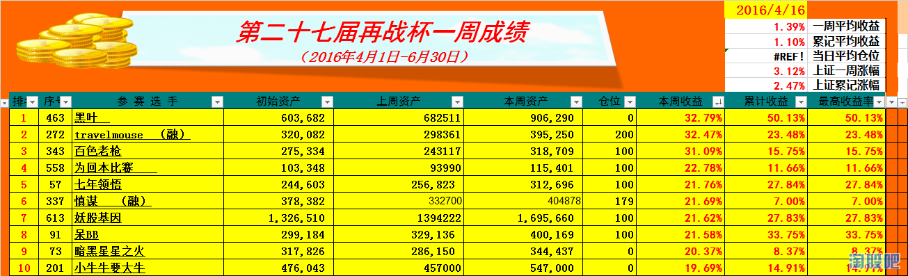

@黑叶   （黑叶兄，听说你开了一个实盘，不如你将最近一个月的历史成交单上传，并说说心得，可好？）
@travelmouse  （融资厉害）
@百色老枪   （老枪这上升速度杠杠滴）
@为回本比赛   （请问 本金是多少？）
@七年领悟     （本届再战杯由七年领悟兄独家赞助，特此鸣谢）
@慎谋  
@妖股基因
@呆BB
@暗黑星星之火  （暗黑，又见暗黑）
@小牛牛要大牛
   
恭喜以上前十名的选手本周内取得优异的成绩，请前十名的选手在本周内上传这一周的所有交易记录，历史成交单、并配上文字心得，可以吐槽、可以装逼，可以传授经验，这一周，你就是耀眼的明星。

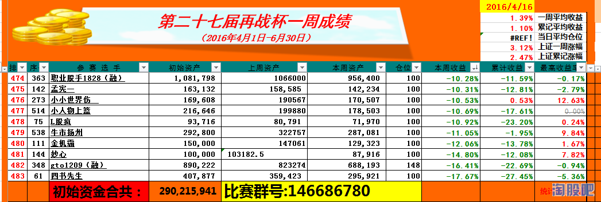

@职业股手1828
@孟宪一
@小小世界伤 
@小人物上篮
@L股疯
@牛市扬州
@金机霸
@妙心
@gto1209
@四书先生
       
以上十位选手本周颇为失利，但某瑞仙说过，失败的交易，更值得我们学习。请以上十位选手也发一下一周历史成交记录，并文明自我描述一翻亏损的原因，可以吗？我在伤口撒盐，听说痛着痛着，就不会再痛了。
       
## Top 10
### 1 黑叶

在恰当的时机买有强烈赚钱效应,有市场人气的股.顺势而为.当然也有运气成分，所以大家好运罗！还要感谢很多超短前辈在论坛留下的经验,学习了很多.发下最近一个月的交割单,有兴趣的看看.

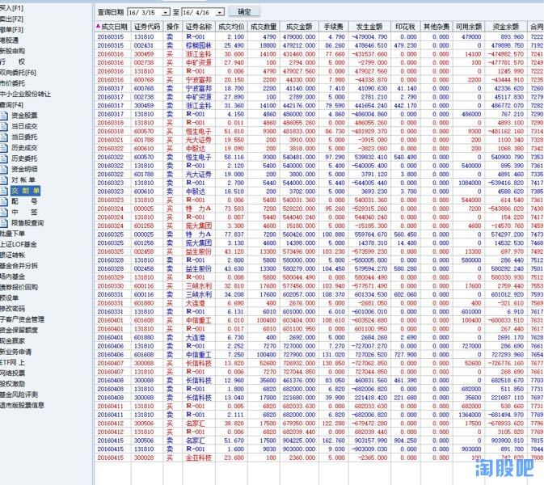

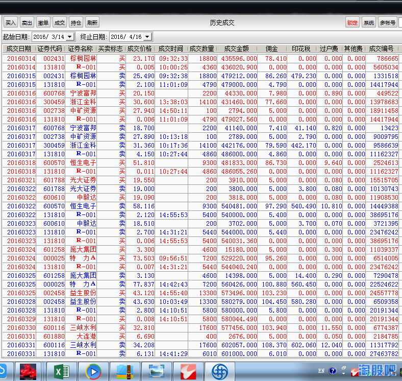

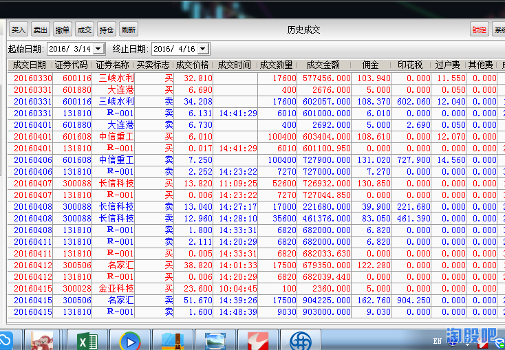

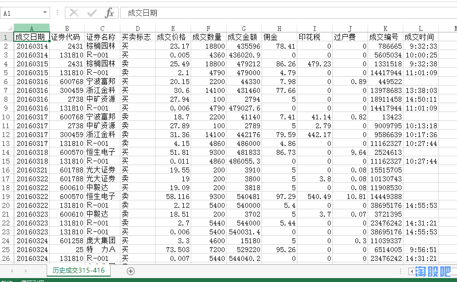

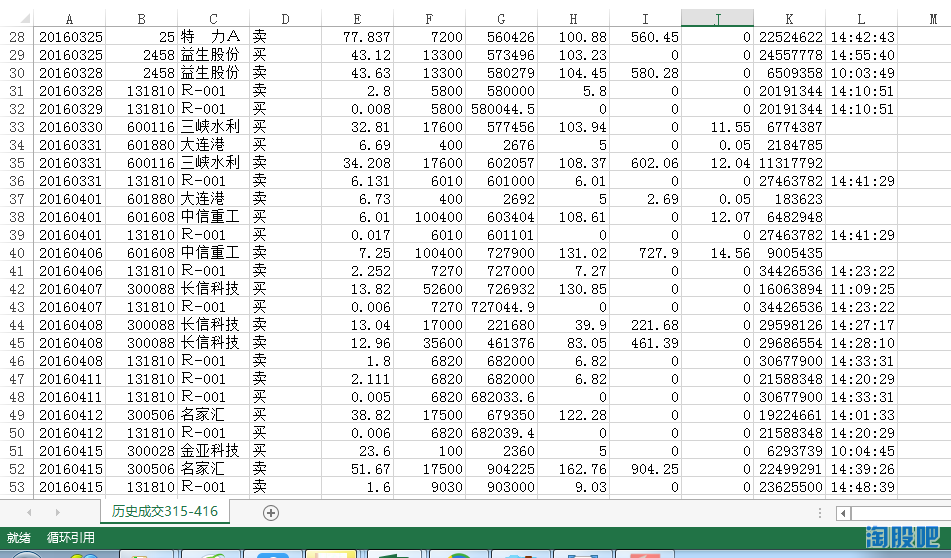

### 2 travelmouse

很高兴本周可以进入前十名，没想到交割单是按照周收益来算的，竟然可以有机会被别人打假了，很是开心，感谢上证给机会！
   
本人虽然股龄不短了，07年入市，但还是标准的小散捂股模式，12年因为雷神的文章来到淘股吧，受雷神和守望的影响比较大，很感谢雷神和守望兄。@守望高新，@时光猎人，@成都雷立刚，相信小资金快速盈利有两个模式，一个是淘县流行的圣杯模式，控制回撤，另外一个是行情好时融资满仓大胆干，全仓重仓一只股，本来打算全仓金刚的，但现在融资账户做了限制，单一持股不可以超过资产的70%！
   
去年股灾期间，因为股票停盘躲过了股灾1.0，2.0，3.0，虽然看到很多人股灾期间损失惨重，但还是全程参与了今年熔断以来的股灾4.0，损失到肉疼，所以才参加实盘赛，希望借助再战杯可以督促自己可以在行情不好的学会休息！
   
本人的账户可以作为行情的参考，如果还能够，盈利就说明整体行情还不错！
   
本周交易说明：盘中的操作初衷不是为了做T，而是为了增加融资持仓，因此有的T成功，有的是不成功的！

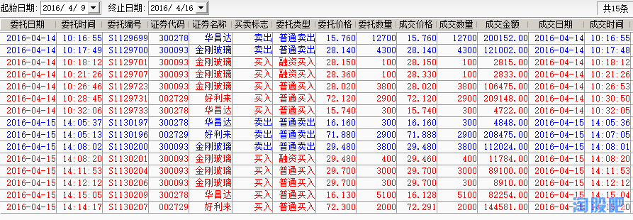

### 3 百色老枪

### 4 为回本比赛

### 5 七年领悟
主要说下本周购买 000882 华联的心得，华联从盘子看很大，涨停第一天就关注但当天没上板，因为打板打残了。第二天该股高开5%左右直接往下打，不清楚是出货还是洗盘，分析应该是打板的短线获利盘止盈造成的抛压，真正的主力并不想硬接，那么就顺势而为的向下打。因不确定是调整还是洗盘就试探性低位建了个底仓，看第二天盘面情况在进行决定。果然第二天大盘还是很理想，但是该股却迟迟未发起上攻，感觉被无形之手给控制住了，所以就顺势与庄家一起低位慢慢加仓。到尾盘加到80%仓位。晚上就出利好，也就是淘股吧一些大神开始扒网红概念，以及饿了么由阿里巴巴及蚂蚁金服共投资12.5亿美元（不是人民币），结合该股的走势看，第二天肯定要拉，早盘不出所料直接被百万手大单封死一字。所以我并不看重该股网红的投资价值目前能有多大的的收益，看重后者饿了么的股权升值的价值！所以这次有幸买到，运气占很大一部分！
       
真心希望在淘股吧广交股友，以股会友，向前辈们学习致敬！@上证  @ 法拉利  @骑在牛股上 @ 胖妹  @屠龙者  @asking  @姓股名神 @金机霸@dfusmku    @yxkrrhx  @葵花宝典 @职业炒手 @张学友来炒股 @佛山无影脚 @独股一箭  @榜中榜 @狙击手A   ，因为学习了很多你们的东西才能使我短暂的成为前10名，我真心希望自己能成为一名向你们一样的无私的大神！很显然，我距离你们还有十万八千里，但我会继续努力，勤能补拙！

同时感谢@湖南人 @柏拉爱空 @幽兰行天下@卖电子书，等复盘大师们给予的支持。当然也要感谢此次帮忙点将的@上之上策 兄的分析.

话匣子打开收不住了，停~！！希望日后还能有机会再来发言！

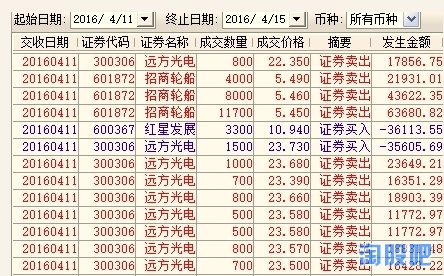
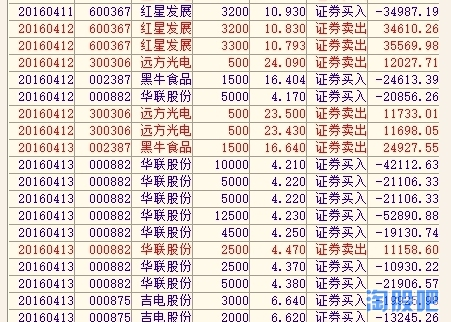
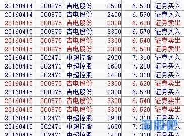

### 6 慎谋

非常意外，本周收益进前十。感谢组织，感谢@上证，感谢淘股吧！
       
我也是一个小菜鸟，只是在不断完善自己的交易模式，可以从我的交割单看出，我不是很喜欢频繁操作。上周和上上周一直只都是拿着一只博瑞传播，上周开始尝试做些改变，希望可以有所进步。

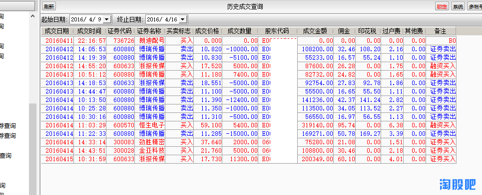

### 7 妖股基因

我这种满仓一只股属于赌徒模式，周一雅百特获利卖出但尾盘追高白云电器犯错没能知行合一，周二止损白云电器低吸浙江金科盘中一度空欢喜尾盘回落盈亏同源，周三止损浙江金科及时切入名家汇周四没动到周五卖出，名家汇属于模式内的个股虽然未买在最低卖在最高但属于自己有能力吃到的一截，周五卖出名家汇买回雅百特博个短线反抽；天天换股瞎折腾，蒙对大肉运气成分多，由于看盘精力有限，所以只赌一只，朋友们请勿模仿，满仓一只股风险大，虽然我没遇到过停牌个股，假如一旦遇到可能直接回到解放前，所以后面仍需努力争取所买个股不被关。
       
感谢淘股吧各位前辈的心得体会，感谢每日分享复盘的各位辛勤小蜜蜂，感谢再战杯管理员和统计员，感谢股天乐为我们提供平台，祝各位吧友战友周末愉快！

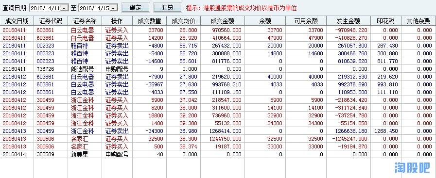

### 8 呆BB  
最近运气比较好，差不多1-2天换一只股，每只都是赚钱的，还是要感谢@张学友来炒股 教我绝招，看你天天次新搞进搞出，于是我也开始搞了昊志机电、坚朗五金，虽然胆子小没搞名家汇，但赚钱了就好也不后悔，希望运气一直好下去。。。附上交割单

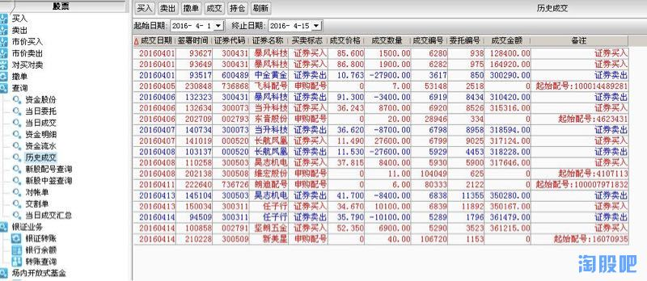
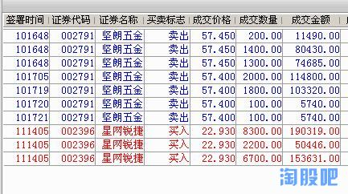

### 9 暗黑星星之火

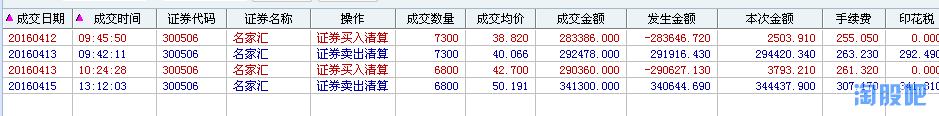

### 10 小牛牛要大牛
   
### 内裤不能输 (融资)

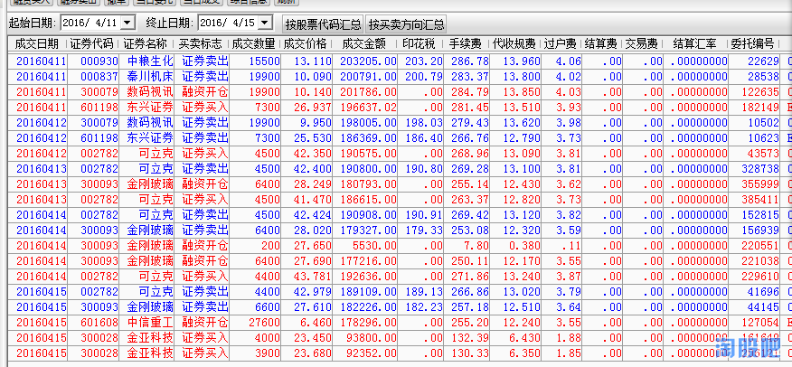
## Last 10

### 孟宪一  

龙头上不到，就没了主意，乱买了几支，导致心态不稳。
   
最大的问题是本周一个主流都没有买到，和市场脱节。
最大的亏损是东兴证券，上东兴证券的原因是整个券商板块都起来，东兴是龙一，又沾次新的概念。
自己摸索真的是困难重重，好在可以通过比赛体会一下高手的操作思路。

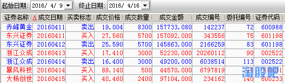