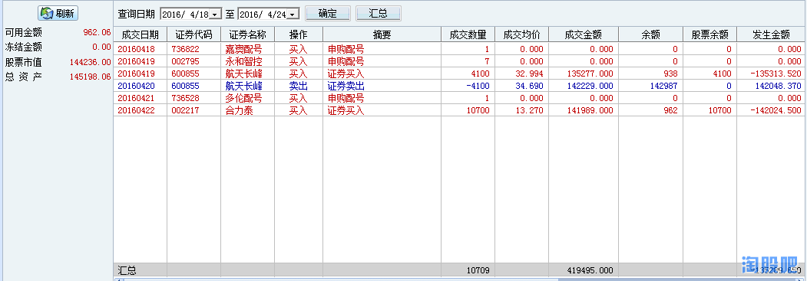

# 2016/4/22

comment: 这周赚得多的主要原因是大跌的时候空仓

@sirenyun  这周很牛啊
@復利增長  很多人都看你的买单喔
@小小世界伤 
@jackyjiam
@炒股不看盘     （阿尔法）
@谁是第一
@孤独牛背
@行云168
@笑看风云888（融）
@阿契厄斯  
       
恭喜以上前十名的选手本周内取得优异的成绩，请前十名的选手在本周内上传这一周的所有交易记录，历史成交单、并配上文字心得，可以吐槽、可以装逼，可以传授经验，这一周，你就是耀眼的明星。

## 1 sirenyun  这周很牛啊

刚才习惯性的打开手机想学习一下高手的交割单的，没想到，，，我就一笔交易，，其实是上周带来的利润， 昨天一度想在90元左右再追多氟多，但是没有下单，
       
多氟多是在19日尾盘卖的，我想看看有没有冲动资金拉升过百，结果没有。

## 2 復利增長  很多人都看你的买单喔

## 3 小小世界伤 

我没看错吧，这周交易我竟然前十，表示很无语O__O"…，因为上周交易我倒数前10，也不知道说什么了，因为这周我空仓，上周银宝山新高点入被套10个点，一直忍着没卖，这周银宝山新冲涨停赶紧卖掉了，后面我好害怕，一直不敢开仓，无语O__O"…...........

## 4 jackyjiam
## 5 炒股不看盘     （阿尔法）
大跌那天正好空仓，纯属运气。

## 6 谁是第一

588/一周交割单
本人资金小，操作起来比那些大资金要灵活，
真正的高手都在百万杯里
再加上本人运气成分，躲过了那天大跌。

## 7 孤独牛背

抱住以稳为主的心态，这周这样成绩能前十，实在有些意外，弱势多看少动，永远是对的。
   
很多人问我3506周四为什么能坚持到下午，上午外面热火朝天，自己的股确给按住打，但是心理一点都不乱，1、周三大跌自己因为仓位少还是 300484 ，盘中高位出局， 300506 又是中午接近收盘买的，当天大盘爆跌，自己反而赚钱。2、周四其实只有资源股强，外强中干，恰好资源股不是我喜欢追的板块。3、3506本身就是高人气高换手的龙头新股，这样的股值得用全天等一波强势脉冲。
就这些思路，很简单，也很普通，但就是我的干货。
最后感谢上证，感谢法拉利美眉！

## 8 行云168

我有一些买卖是为了融资更多，因为现金可以担保买更多的票，所以，我就卖出股票，然后马上再融资买回，这样可以买更多。
这次进周前十还是有些意外。以前的时候都是周二三十名的。

## 9 笑看风云888（融）

先吐槽一下证券公司，要不是3.30被打电话来问账号，被吓得当日抛空满仓加融资的国海证券，次日一天就能把4月目前的参赛收益提前并超额捞到了！
       
   
老韭菜一枚，经历过3次牛市翻翻-追加投入-亏掉底裤的过程，累计账户中消失的本金可以参加XXX万杯比赛了。
真没想到能进一周前10，得到装逼机会。机会难得赶紧装：
   
虽然本周收益对高手不值一提，但还是超过我参赛前定下来的目标--争取平均每日赚0.5%，况且连续6周没有回撤，自己还是算满意的，喜欢乘方的朋友先别算如果连续8年10年会怎么怎么样，苦逼的层主正算不清什么时候能将回本。
希望继续好运，能在“七亏二平一赢”的一赢阵营里稳定存在,再亏掉这点本金LP不会赞同再追加了。 
   
感谢桃县，去年无意进桃县之后才发现，买入股票后除了原来的死抱到底外，原来还能炒--粤菜、鲁菜、川菜...各种花式的炒；
感谢 @榜中榜   观摩华斯股份的操作手法后，第一次做到连续隔日超短8个交易日能浮盈40%+
感谢 @雪儿111  看你的贴才第一次知道缠论，虽然我只能勉强看明白一点前50课，但也能豁然开朗
最感谢的是 @职业炒手  进攻可使账户在后两次股灾前期几天逆市做到赚30-50%，然并卵，不会防守的结果是每次到灾后倒贴30-50%。看完炒手兄致老雷的贴后最大的收获就是：一看不妙，敢于自宫。炒股葵花宝典的提法印象中好像是炒手兄先提的，手起刀落，世界清静了，回撤也控制住了。下跌时木有舍，反弹时就木有得。 
然后感谢 @89年的瘦子  你提到的“各周期背离结构对应的时间跨度”真不错，原来股市潮起潮落的节奏是可以静心体会的。
   
最后想提醒自己一句，账户中虽然是数字，实际上是实实在在的钞票；每次买入前都应该想想，是要买的票站在风口的可能性大？还是更大的可能是把自己的钞票放到了风口？？
   
装逼到此结束，接着按赛事规矩说一下上周操作思路：
到4月15日沪指MACD累计连续红柱46天，而2015年最佳2次表现仅为45、47天，预估下跌不可避免，提前埋伏的中信重工到调整8日时间窗口未出现指望的弱市炒妖股，4.19果断杀；
苦逼上班族4.20开市前下的低吸次新股 埋伏单当日被套次日早盘反弹杀。
周五再在开市前下埋伏单低吸次新股。
   
发现还是弱市炒次新靠谱，本月主要利润来源
由于上班不能及时盯盘，所以买卖点不会是分时图上的好点位。

   
## 10 阿契厄斯  
写了半天，本来想自嘲一下的，结果搞了半天，文档没存下来，不想写了，就贴交割单吧，纯粹是靠新股拉盈利，不然本周还亏5%，该犯的错误一个没拉下，主要还是执行力问题，争取下周靠本事进入周涨幅前10

## 再战杯第三周比赛成绩排名 
       
一周成绩统计表，本表格不包括ST选手、请假、退赛选手、不包括上周请假的选手。本表只反映这一周来选手的盈亏情况。没有成绩的选手先看看是否有以上情况

       
