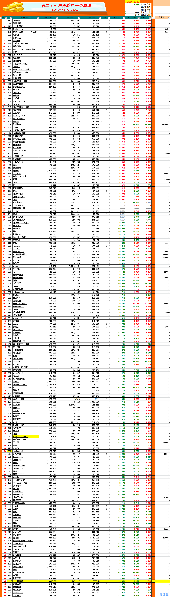

# 2016/4/22

comment: 这周赚得多的主要原因是大跌的时候空仓

@sirenyun  这周很牛啊
@復利增長  很多人都看你的买单喔
@小小世界伤 
@jackyjiam
@炒股不看盘     （阿尔法）
@谁是第一
@孤独牛背
@行云168
@笑看风云888（融）
@阿契厄斯  
       
恭喜以上前十名的选手本周内取得优异的成绩，请前十名的选手在本周内上传这一周的所有交易记录，历史成交单、并配上文字心得，可以吐槽、可以装逼，可以传授经验，这一周，你就是耀眼的明星。

## 1 sirenyun  这周很牛啊
## 2 復利增長  很多人都看你的买单喔
## 3 小小世界伤 
## 4 jackyjiam
## 5 炒股不看盘     （阿尔法）
## 6 谁是第一
## 7 孤独牛背
## 8 行云168
## 9 笑看风云888（融）
## 10 阿契厄斯  

## 再战杯第三周比赛成绩排名 
       
一周成绩统计表，本表格不包括ST选手、请假、退赛选手、不包括上周请假的选手。本表只反映这一周来选手的盈亏情况。没有成绩的选手先看看是否有以上情况

       
