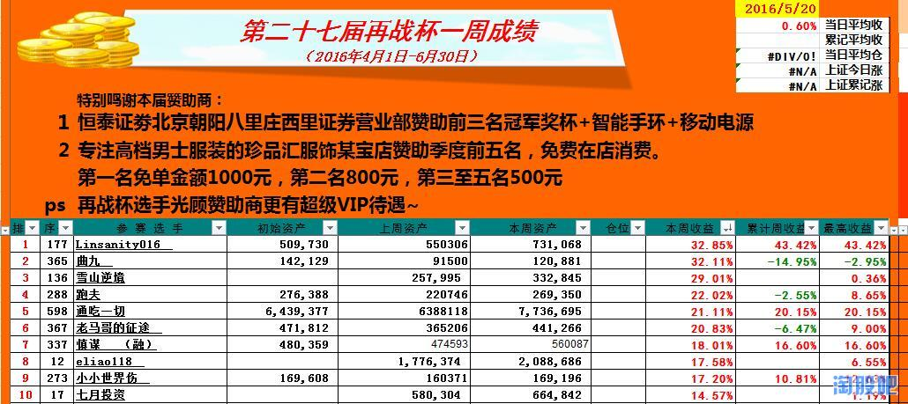
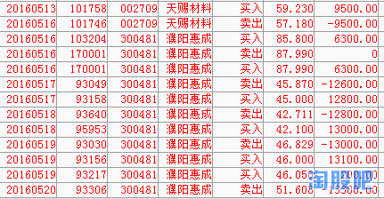
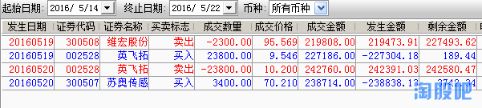
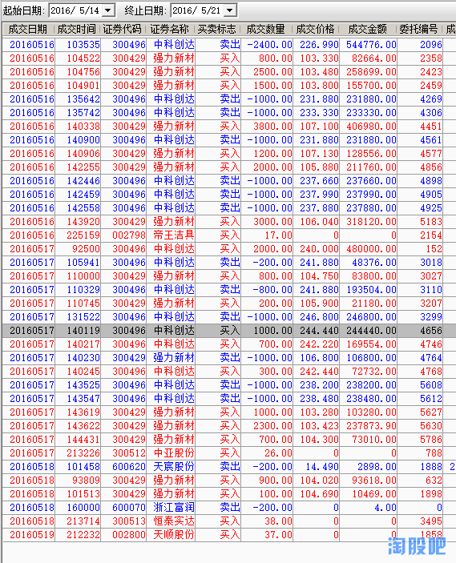
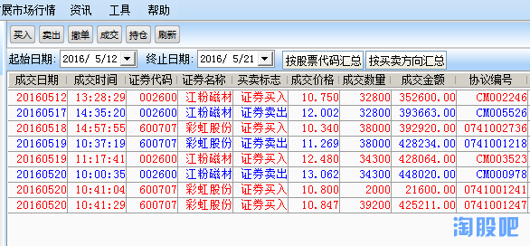
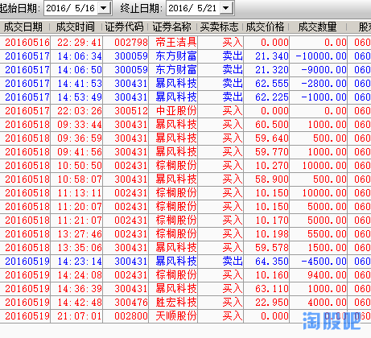
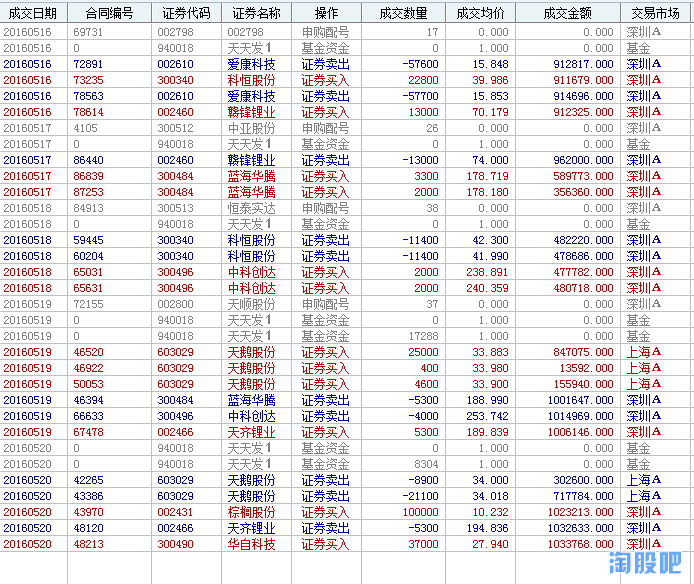
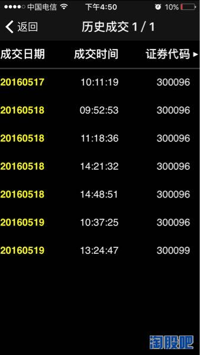

# 2016-5-20 周五

1. Linsanity016 
1. 曲九 
1. 雪山逆境
1. 跑夫
1. 通吃一切
1. 老马哥的征途 
1. 慎谋  （融）
1. eliao118 
1. 小小世界伤 
1. 七月投资

## 1. Linsanity016 

 非常荣幸能夺得这周第一名，望好运再续！
下心得吧，首先本周操作都是按计划行事，节奏相对不错！本来上周五非常期待锂电池 的2709走主升浪的，即使当天微套还是非常有信心的,不料高管精准减持直接影响了星期一的走势，在众多锂电池纷纷翻红时却迟迟不能飘红，然而此时自选股里的其他股票却都表现不错，映入眼帘的两只票2786和0481都3个点涨幅以上，所以在当天相对高位就忍痛割肉，决定去弱追强，由于本人习惯满仓一股，于是就不得不在这两之间做出选择，最后权衡利弊，果断买入在前天涨停被砸情况下敢于再创新高的0481，事后两只当天都涨停了，老朋友2786稍出乎意料，在0481涨停刺激下激发了我的信心，当晚就YY将连续涨板开启填权 行情，岂料第二天走势给了我当头一棒，在网金，万达大幅拉伸带动创业板反弹的情况下，它却逆势逐波回落至收跌5个点，让我从大肉到小亏,收盘后一直在想第二天如何操作，是去是留好，最后仔细想想老热点网金，大健康 是不可持续的，资金要做还得回到锂电池，稀土和OLED 上来,结合历来牛股大部分要挂从不会一下挂，更不会尖顶挂，在回翻了002261.300010. 2015.5.14也是大阴棒后一天的表现，阴线就没那么可怕了，觉得空中换挡大更加鼓舞了我的信心，人一下就豁朗开朗了，坚定第二天持股的计划就形成了，果然第二天走势很给力验证了我的判断，而且是逆势封板，这时周四继续连扳基本是板上钉钉的，中间做了3次T，其中最有把握的是周四，这票从启动开始有不留缺口的习惯，当天高开两个多点果断先卖，待回补缺口刹那间速进，在这还是不鼓励做T,牛股还是捂的好，辛辛苦苦T出几个点，还不如卖点把握好，万一T飞了就更得不偿失了，今天卖的就比较差，不过也心满意足拉，0481开盘卖出买2786也是昨晚就决定的事情，本以为绿盘可从容买进的，岂料拉伸翻红时间过早，不得不紧跟主力步伐，不管高不高果断上了，2786今天起了带头的作用，希望下周有不错的表现，操作思路大致就是这样！
## 2. 曲九 
昨天我的报单错了
## 3. 雪山逆境

领导，我的排名是乌龙事件，上周末我报单时填错了数字，导致成绩大起大落，这是我的问题，十分抱歉！
## 4. 跑夫

 目前比赛账户还是亏损， 也是做的最差的， 希望接下里能调整心态一跃而上。
 
 
## 5. 通吃一切
 本周账户涨幅较大主要是持仓的中科创达和强力新材大幅拉升所致，下周可能会短期回调，但中期还是准备继续持仓。
 
 
## 6. 老马哥的征途 
作为曾经的倒数前十，现在的亏货，实在没什么好说的，祝大家赛出水平！

## 7. 慎谋  （融）
本周交割单如下，上周挖了个大坑，本周就是填坑。

 
## 8. eliao118 

自己的模式不清，基本凭感觉和经验操作。

## 9. 小小世界伤 
## 10. 七月投资

这周之所以收益率高，是因为上周太低，谁家过年不吃顿饺子，下面是本周交割单 

