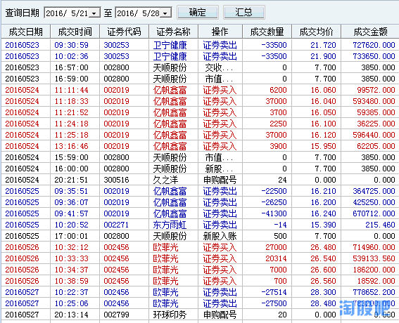

# 2016-5-27 周五

1. 我爱巧克力
1. 刀疤老二
1. 大器在握
1. 国产零零七
1. lifestyleleak
1. 我想做个木匠 
1. lioncn88
1. 九监九介
1. 帕丁顿熊
1. 总想吃肉

## 1. 我爱巧克力

去年亏了90%，今年亏了80%，不知道这周是回光返照还是否极泰来？

## 2. 刀疤老二
## 3. 大器在握
在这里不敢说实力，只能说运气好。
   
我爱火神，爱我火神。
火神加油，加油火神，
   
无脑脑残粉。

## 4. 国产零零七
做的并不好，如何控制回撤才是下步需要解决的问题。

## 5. lifestyleleak
盈利大部分是新股盈利，没什么可说的，希望下周能有更好的表现

## 6. 我想做个木匠 (涨停模式)
本周操作没变，模式没变，只是运气好。装逼完毕，谢谢大家。

## 7. lioncn88
## 8. 九监九介
## 9. 帕丁顿熊

其实做得不好，前三天乏善可陈没啥可说，周四早盘大盘下跌时感觉永磁、OLED 等几个强势板块承接很好，但又犯了保守的老毛病，先错过磁性材料，然后又买了个OLED擦边球，愣是不敢买707，弱爆了!
       
上半年目标完成，再接再厉吧！

## 10. 总想吃肉

