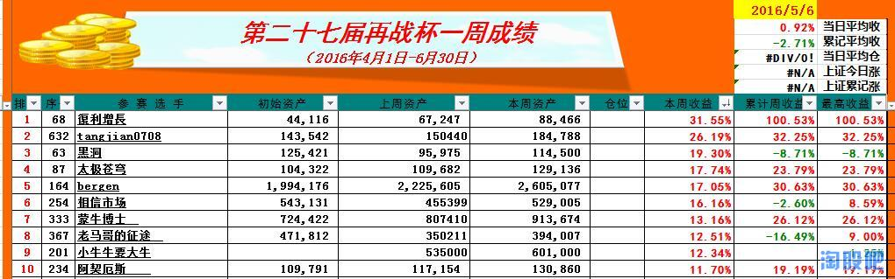
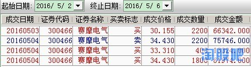
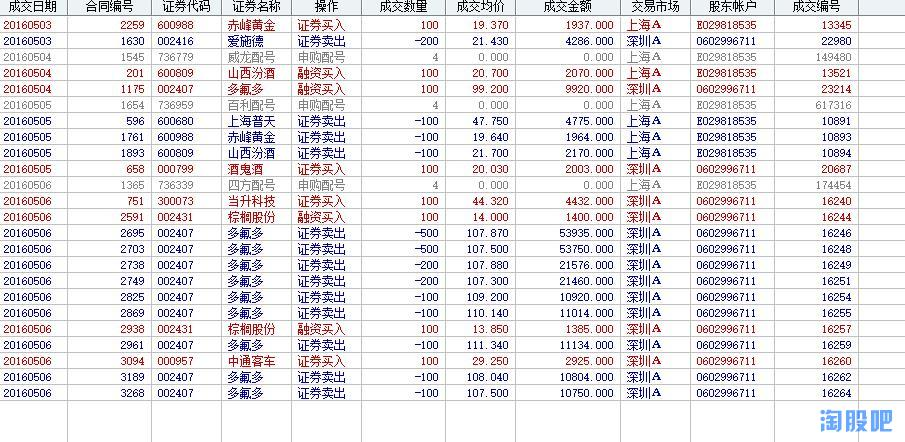
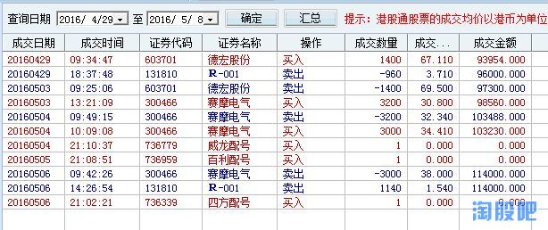
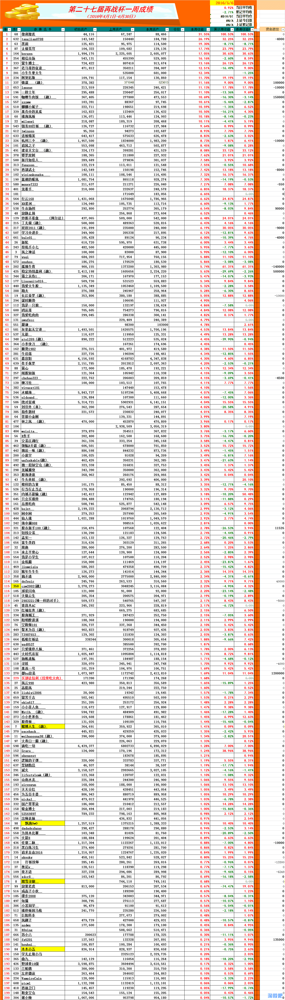
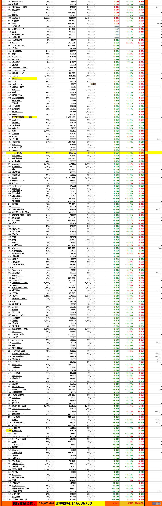

# 2016/05/06

@復利增長
@tangjian0708
@黑洞
@太极苍穹
@bergen
@相信市场
@蒙牛博士 
@老马哥的征途 
@小牛牛要大牛
@阿契厄斯  
   
   
恭喜以上前十名的选手本周内取得优异的成绩，请前十名的选手在本周内上传这一周的所有交易记录，历史成交单、并配上文字心得，可以吐槽、可以装逼，可以传授经验，这一周，你就是耀眼的明星。

## 1 @復利增長

高转送 填权

## 2 @tangjian0708

短时间内的成绩，虽然很好，我认为运气成分居多吧。有一句话和各位共勉：炒股是长期的职业，不要在意一时的成败。这是我参加再战杯最大的体会。
## 3 @黑洞

## 4 @太极苍穹

这周收益竟然能排进前10，略意外。
本质上，这周的交易都处于模式的边缘，并不满意。
   
操作还要提高，不严谨。
   
希望下周继续努力。

## 5 @bergen
## 6 @相信市场
## 7 @蒙牛博士 
## 8 @老马哥的征途 
## 9 @小牛牛要大牛
## 10 @阿契厄斯  
每次都是靠新股的收益蹭上周收益排名前10，低吸模式也还在摸索中，都是轻仓分仓搞，周五搞个突破还被惨套，下周还不知道能否重仓位搞低吸，等新股卖出后，学Sraro，将新股收益作为新入股资金，重新计算收益，不然，老看到收益增长，还以为自己有多厉害啊，不利于自己水平增加。

